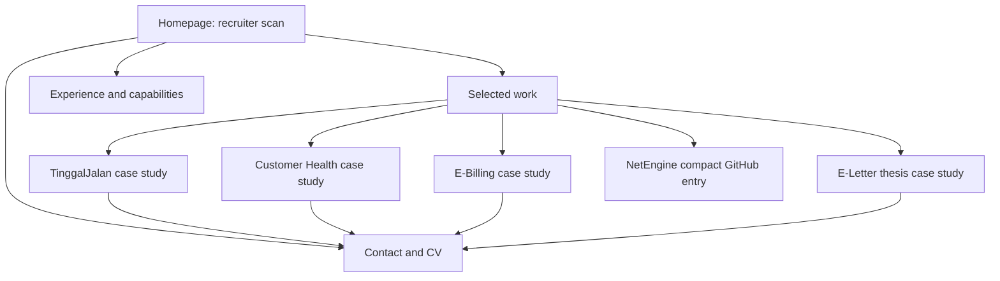

# Information Architecture

## Recommended format

Use a focused homepage plus separate case-study pages. The homepage should make the interview argument in under two minutes; case-study pages should answer technical follow-up questions without making the homepage heavy.

Do not put complete case studies in homepage accordions or one long page. Separate routes provide better linking from applications, clearer metadata, stronger reading progress, and easier future editing.

## Route map

```text
/
├── #selected-work
├── #experience
├── #capabilities
├── #leadership
├── #contact
├── /work/tinggaljalan/
├── /work/customer-health/
├── /work/e-billing/
└── /work/e-letter/
```

NetEngine is a compact supporting item on the homepage's selected-work section. A separate page is deferred. GitHub and CV are outbound/download actions, not primary navigation destinations.

## Navigation

Desktop navigation:

- Work
- Experience
- Capabilities
- About/Leadership (one combined anchor, not a biography page)
- Contact
- CV (quiet secondary action)

Mobile navigation should keep the same information order in a compact disclosure menu, preserve a visible contact action, and avoid a horizontally scrolling nav. On case studies, include “Selected work” back-navigation and previous/next links only if they do not distract from contact.

## Homepage hierarchy

1. **Hero** — name, refined positioning, one-sentence value proposition, location, availability status if confirmed, primary “View selected work” action, secondary CV/contact action.
2. **Evidence strip** — three non-metric proof statements: operational systems; integrations and data; production delivery. Avoid counting projects or technologies.
3. **Selected work** — four ordered project cards with status labels and distinct claims. Make the first three visible early. Add NetEngine as a smaller supporting entry after the full-study cards.
4. **Experience** — concise timeline emphasizing PT Skynet context, Jobnation contribution, and the work-permit internship. Do not repeat project descriptions verbatim.
5. **Technical capabilities** — grouped by engineering responsibility, not a logo cloud: workflow/data; Laravel/backend; integrations; delivery/operations; supporting frontend.
6. **How Fairus works** — short sequence from requirements to production troubleshooting; this converts the CV summary into a process recruiters can understand.
7. **Leadership** — General Secretary and Organizational Advisor evidence tied to documentation, mentoring, coordination, and operational planning.
8. **Contact** — target roles, location/time zone if useful, email, LinkedIn, GitHub, and CV.
9. **Footer** — name, positioning shorthand, current year, core links. No social feed or framework badge.

## Project-card model

Each full-study card needs:

- project name and one-line category;
- explicit status badge;
- one problem-oriented sentence;
- one unique claim;
- 3–5 restrained technology/integration labels;
- case-study action;
- live and repository links only when safe and authorized.

Use status labels exactly enough to prevent overclaiming:

- TinggalJalan — **Live production application**
- Customer Health — **Deployed · Used operationally**
- E-Billing — **Deployed · Technically completed · Not fully adopted**
- E-Letter — **Deployed undergraduate thesis**
- NetEngine — **Public backend repository · Deployment status TODO**

## Case-study structure

1. Project header: title, display subtitle, status, role/date TODO, live/repository links.
2. At-a-glance: domain, users/actors, responsibilities, stack, evidence boundaries.
3. Problem and constraints.
4. Workflow/data model: concise text plus diagram.
5. Key engineering decisions: two or three, each with context/trade-off.
6. Integrations and failure/state handling.
7. Delivery and verification: tests, deployment, monitoring/operations where evidenced.
8. Evidence gallery: approximately 3–5 purposeful screenshots with captions.
9. Status, limitations, and what is not claimed.
10. Reflection: what Fairus learned or would improve, confirmed by Fairus.
11. Next project/contact action.

E-Letter additionally needs the full official Indonesian title, undergraduate-thesis classification, official record link, research context, verified supervisors/institution, and a concise English display title.

## Experience

Use a reverse-chronological timeline with role, organization, dates, and 2–3 outcome-neutral responsibility bullets. The PT Skynet entry should explain the sole-developer context and 1,100+ active-account environment once. Project case studies carry the detail.

Jobnation should show contribution within existing client codebases, tickets, REST integrations, Laravel/Flutter/landing-page breadth, without implying ownership of all four projects. PT PG Krebet Baru should show the Native PHP work-permit approval/signature workflow as early evidence of business-process thinking.

## Technical capabilities

Recommended groups:

- **Business systems:** requirements, workflow/state modeling, RBAC, relational data design.
- **Laravel backend:** Laravel, PHP, REST APIs, Scheduler, queues, testing, Filament.
- **Integrations and data:** MySQL/MariaDB, migrations/reconciliation, Midtrans, MikroTik, email/WhatsApp.
- **Delivery and operations:** Linux, Docker, GitHub Actions, Coolify/Nixpacks, deployment, health checks, troubleshooting.
- **Full-stack support:** React, Inertia, Livewire, Tailwind; Go/Gin as supporting breadth.

Do not list every technology from the CV. Include only skills tied to evidence or target roles.

## Leadership

Keep leadership to one compact section. Connect UKM Mapala Tursina roles to administration, mentoring junior secretaries, training, navigation/GIS material improvement, expedition planning, and documentation. Do not force leadership metrics or testimonials.

## CV access

Provide both “View CV” and “Download CV” only after a sanitized, current public English CV file is approved. Use a stable descriptive filename and expose no `references/` path. The source CV remains ignored and uncommitted.

## Mobile hierarchy

- Hero positioning and primary action before any portrait or decorative image.
- First selected-work card within the first few screens.
- Single-column cards; status remains adjacent to project title.
- At-a-glance case-study facts become stacked definition lists, not squeezed tables.
- Diagrams must reflow, allow safe horizontal pan, or provide an equivalent text description.
- Screenshots use full-width crops with tap-to-view only if the enlarged asset has already passed privacy review.
- Contact actions remain readable and at least 44×44 CSS pixels.

## Mermaid overview



## Deliberate exclusions

No separate About page, Skills page, Experience page, all-projects archive, blog, contact form, admin area, or CMS in V1. A direct email link is more reliable and creates no data-processing burden.
